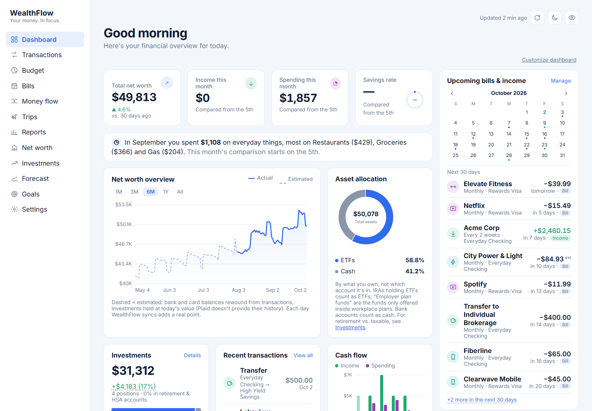
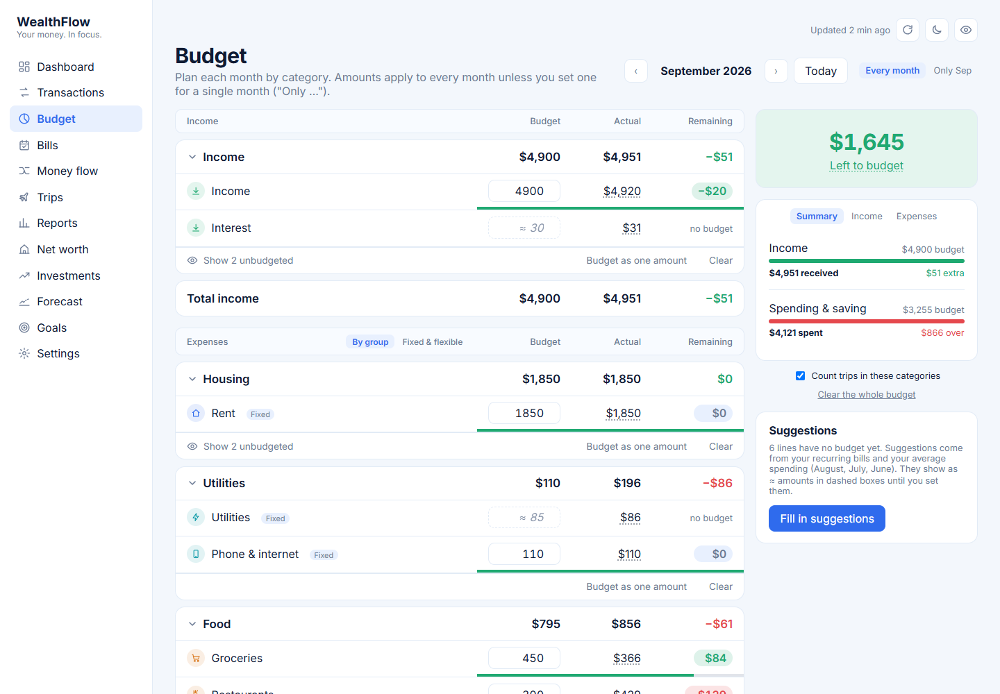
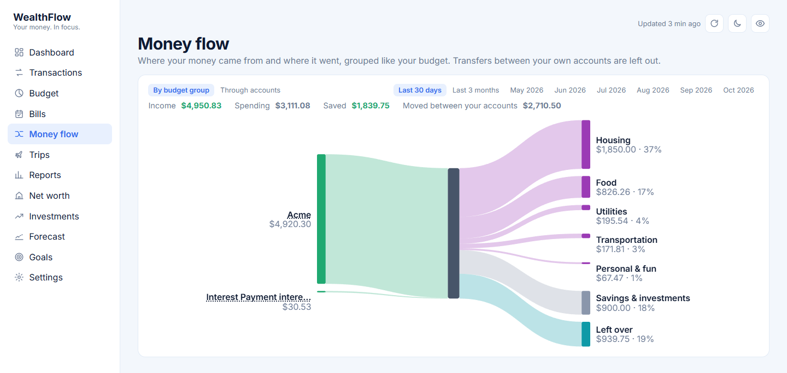
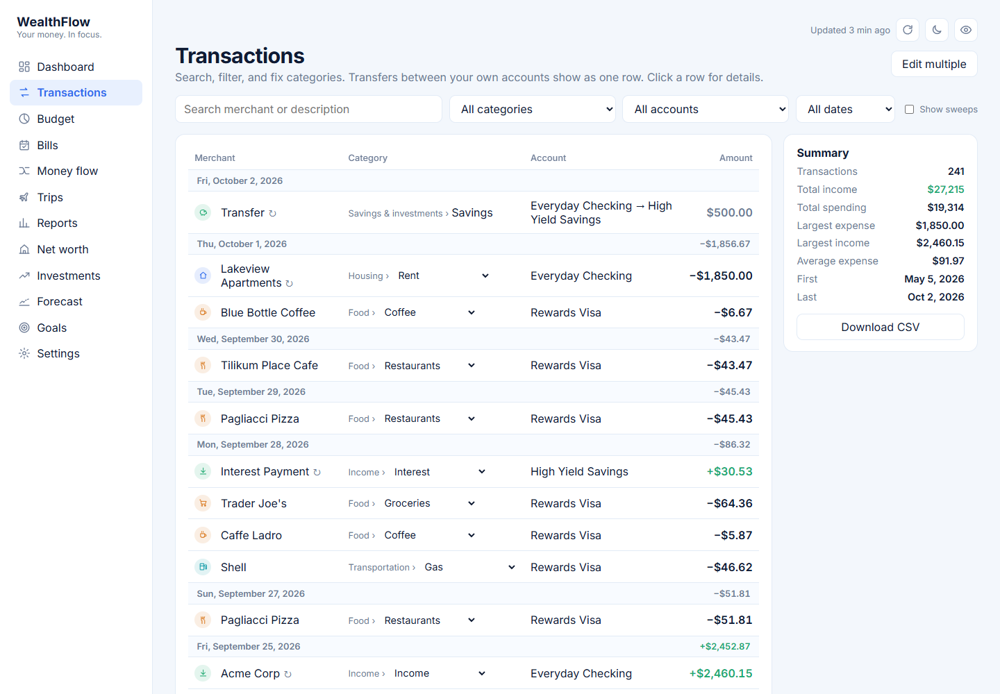
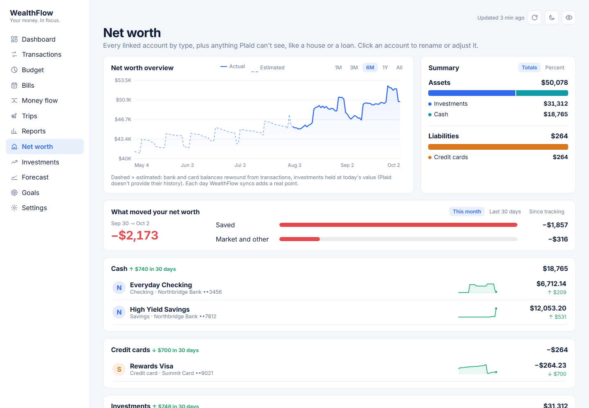
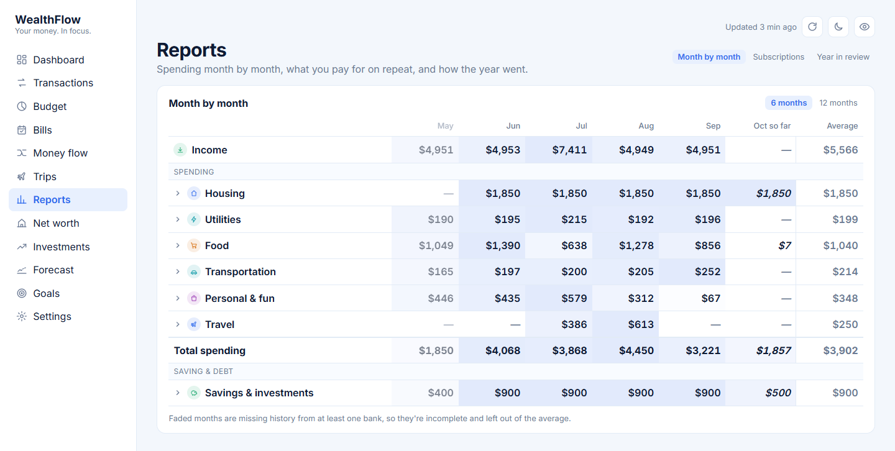
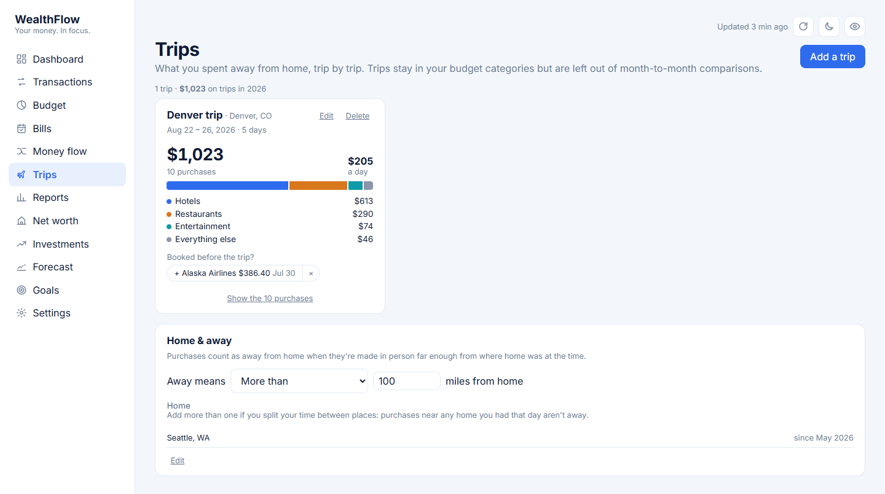

# WealthFlow

A local, single-user finance dashboard on Plaid's free Trial plan: net worth, spending, budgets, goals, holdings, and a projection. Everything runs on your machine, and your data stays in a local SQLite file.

<picture>
  <source media="(prefers-color-scheme: dark)" srcset="docs/screenshots/dashboard-dark.png">
  
</picture>

<sub>Screenshots use an invented household (`npm run demo`), not real data.</sub>

## What it does
- **Dashboard:** net worth, this month's income and spending, what changed vs last month, upcoming bills and income,
  Free to spend (what's left this month after bills, card balances and a cushion), a watchlist, goals and a projection.
  A Getting started checklist walks a new setup through the steps below. Panels can be reordered or hidden.
- **Transactions:** search and filter, fix categories (once or with a rule), split one into several categories,
  and sort what Plaid can't know: transfers to accounts you haven't connected and payments with people (Venmo, Zelle),
  including money friends send you back for a charge.
- **Budget:** per category or as one amount per group, for every month or a single month; fixed, flexible and
  non-monthly bills; rollover for money that builds up between bills; suggestions from your bills and spending.
- **Bills:** recurring bills and income detected from your transactions, Plaid and card statements, on schedules that
  know weekends and bank holidays. One paycheck is enough: it asks how often you're paid.
- **Trips:** suggested from purchases made in person away from home (another state, more than N miles, or abroad;
  several home bases supported), with bookings made beforehand and settle-ups with friends. Trips stay in your
  budget categories (optional) but are left out of month-to-month comparisons.
- **Money flow, Net worth, Investments, Forecast, Goals:** where money went, every account's balance and trend,
  holdings and allocation, a long-term projection, and savings goals with target dates.

| | |
|---|---|
|  |  |
| **Budget** | **Money flow** |
|  |  |
| **Transactions** | **Net worth** |
|  |  |
| **Reports** | **Trips** |

Your data only changes when you change it. WealthFlow only asks you to sort recent transactions (from 3 months before
your first bank connection), since older history tends to have gaps.

## Get started
You need a free [Plaid](https://dashboard.plaid.com/signup) account (US/Canada). Plaid is the service that connects to
your banks; your data comes straight to your computer. Then pick one:

**Windows, nothing to install:** download `WealthFlow-<version>-win-x64.zip` from the
[latest release](https://github.com/Renzo-T/WealthFlow/releases/latest). Before unzipping, right-click the zip ›
**Properties** › tick **Unblock** › OK, so Windows doesn't question the first run. (If you skip that, it may say
"Windows protected your PC": choose **More info > Run anyway**. That's only the first time: once running, WealthFlow
clears the mark Windows put on its launcher, and starting at sign-in never asks. `WealthFlow.cmd` is a script, which
can't carry a publisher signature; the Node inside the download is Node's own signed build.) Unzip it somewhere permanent (e.g. Documents) and double-click
`WealthFlow.cmd`. It opens WealthFlow in your browser. To make the zip yourself from the code, run `npm run package`.

**Any system, from the code:** you need Node 22.13 or newer (see [Installing Node](#installing-node)), then in the
WealthFlow folder:
```
npm install
npm run app
```
and open http://localhost:3000.

### Installing Node
Check what you have with `node -v` in a terminal. Anything from `v22.13.0` up works; if it's older or missing, install
the current **LTS** ("long-term support") version:
- **Windows:** `winget install OpenJS.NodeJS.LTS`, or the Windows installer from [nodejs.org](https://nodejs.org).
  Open a new terminal afterwards so it's found.
- **Mac:** the macOS installer from [nodejs.org](https://nodejs.org), or `brew install node` with Homebrew.
- **Linux:** your distribution's package is often too old; use [nvm](https://github.com/nvm-sh/nvm) or
  [fnm](https://github.com/Schniz/fnm) instead.

If you already use nvm or fnm, `nvm use` (or `fnm use`) in the WealthFlow folder picks the version in `.nvmrc`. After
changing Node, run `npm install` again. WealthFlow says so plainly if your Node is too old, and the Windows download
brings its own Node, so none of this applies to it.

On first run WealthFlow asks for your Plaid **client ID** and **secret** (Plaid dashboard > Developers > Keys) and checks
them with Plaid. Then click **Connect a bank**: Plaid's sign-in page opens in a new tab, and WealthFlow picks up the
connection when you finish there.

- **Sandbox** keys work straight away with test banks (`user_good` / `pass_good`, code `1234`).
- **Production** keys connect your real banks. Request Production access in the Plaid dashboard; the free **Trial plan**
  allows 10 bank connections, and removing one doesn't free its slot, so try things in Sandbox first. Sandbox and
  Production have different secrets; switch in **Settings > Plaid keys**.

## Everyday use
- **Settings > App > Install WealthFlow** (Chrome or Edge) gives it its own window, Start-menu entry and taskbar icon.
- **Settings > App > Start WealthFlow when I sign in** (Windows, optional, off until you turn it on) runs it in the
  background with no window (about 90 MB of memory), checking your banks every 6 hours. What it adds: a complete
  day-by-day balance history (WealthFlow records balances once a day while running, and Plaid can't supply past days,
  so without it net worth and investment charts have gaps on days you didn't open it), daily automatic backups, and an
  app that's already up to date when you open it. Without it, transactions still catch up whenever you open it.
- **Settings > App > Let the app window start WealthFlow** (Windows): if WealthFlow isn't running, the window shows a
  **Start WealthFlow** button, so the Start-menu or taskbar shortcut always works. Your browser asks before starting it
  the first time ("Open WealthFlow?"); it can always allow. Without it, the window says WealthFlow isn't running and
  how to start it.
- **Settings > App > Stop WealthFlow** stops the background copy.

On Mac and Linux, start it with `npm run app`; starting at sign-in and the Start button are Windows-only for now.

## Your data
Everything stays on your computer, in WealthFlow's data folder:
- **Download:** `%LOCALAPPDATA%\WealthFlow`, so replacing the app folder with a newer version keeps your data.
- **From the code:** `data/` in the project. `WEALTHFLOW_DATA_DIR` moves it.

It holds the database, daily automatic backups (`backups/`, the last 14), `app.log`, and `config.json` with your Plaid
keys and the key that encrypts your bank connections. **Settings > Backup** downloads a copy of the database; keep a
copy of `config.json` with it, since without that key every bank has to be connected again (using new slots). To
restore, stop WealthFlow, put the backup in place of `wealthflow.db`, and start it again.

**Updating:** when a new version is out, WealthFlow says so in the top bar and in **Settings > Updates** (it checks
GitHub's releases about once a day; you can turn that off there). Stop WealthFlow, then replace the folder with the
new download (or `git pull` and `npm install`), and start it again. If "Start when I sign in" or "Let the app window
start WealthFlow" was on and the folder moved, turn it off and on.

**Sharing:** each person needs their own copy with their own Plaid account and keys. Never send someone your data
folder, `config.json` or `.env`: your keys would use your 10 slots and put their bank connections in your database.

## Privacy and security
- **No WealthFlow servers.** There's no account, sign-up or analytics. WealthFlow only listens on this computer
  (`localhost`), so other devices on your network can't open it.
- **What goes over the internet:** WealthFlow's requests to Plaid (your transactions, balances, holdings and card
  statements come back), Plaid's sign-in page when you connect a bank, and merchant logos, which load from addresses
  Plaid provides. About once a day it also asks GitHub whether a newer version is out (an anonymous request; turn it
  off in Settings > Updates). Nothing else; even the font is bundled.
- **Your bank passwords never reach WealthFlow.** You sign in on Plaid's page; WealthFlow only gets a Plaid access
  token per bank.
- **Encrypted:** those access tokens, with AES-256-GCM, using the key in `config.json` (created on first run). The
  rest of the database (transactions, balances) is a plain file in your data folder, protected by your user account
  like your other documents; anyone who can read your files can read it.
- **Your own Plaid account:** your keys let whoever has them connect banks and read data through your Plaid account,
  so keep `config.json` (and `.env`, if you use one) private, and don't share copies set up with your keys.
- **Hide amounts** (the eye in the top bar) blurs every dollar figure, for screen sharing.

## For developers
- `npm start`: the API (port 4000, restarts on changes) and Vite (port 3000, live reload) together. `npm run app` and
  `npm start` both use port 3000, so stop one before starting the other.
- `npm test`: server tests against an in-memory database, including real HTTP requests to the routes.
- `npm run check:ui`: with the app running, loads every page in headless Chrome or Edge (light and dark) and fails on
  errors, failed requests or broken layouts; screenshots go to `ui-shots/`.
- `npm run verify`: everything above plus a production build and a scan that refuses secrets. It runs automatically
  before every commit (`npm install` turns the hook on).
- `npm run demo -- <empty folder>`: fills a new data folder with an invented household (five months of pay, bills,
  spending, savings, investments and a trip), for trying WealthFlow without a bank or retaking the screenshots. Run it
  with `WEALTHFLOW_DATA_DIR=<folder> WEALTHFLOW_PORT=3100 node scripts/app.mjs`; it can't sync, since the banks are made up.
- `npm run package`: the Windows download in `release/` (bundles the official Node from nodejs.org).
- `npm run release [patch|minor|major]`: publishes a version from a clean, up-to-date `main`. It bumps
  `package.json`, commits through the usual checks (a few minutes; stopping it or a failed check undoes the bump),
  tags and pushes; GitHub then builds the download on Windows and publishes the release
  (`.github/workflows/release.yml`). Copies with update checks on see it within a day.
- `.env` (see `.env.example`) overrides `config.json`, handy for development. `certs/localhost.pem` and
  `certs/localhost-key.pem` (e.g. from mkcert) make the app use https; only the embedded-Link fallback needs that.
- `CLAUDE.md` describes the architecture, the data flow and the Plaid quirks handled.

## Troubleshooting
- **"WealthFlow isn't running" / the page doesn't load:** start it (`WealthFlow.cmd` or `npm run app`). If it still
  won't start, the end of `app.log` in the data folder says why.
- **"Port 3000 is in use":** another WealthFlow (perhaps the one started at sign-in) or `npm start` is already
  running. Use that one, or stop it first.
- **"Plaid didn't accept those keys":** copy the whole client ID, and the secret for the environment you picked
  (Sandbox and Production secrets differ).
- **"Needs Node 22.13 or newer":** see [Installing Node](#installing-node) (or use the Windows download, which brings its own).
- **A bank needs you to sign in again** (red banner): click **Reconnect**. Plaid's page opens in a new tab; finish
  there.
- **"Couldn't update" a bank** (amber banner): the bank or Plaid was unavailable, or the internet was down. Nothing to
  do: WealthFlow tries again at the next sync (and when it starts), or click **Try again**. Don't reconnect for this;
  it would only use up a connection slot. If it keeps happening, the reason in the banner and `app.log` say why.
- **"Add holdings" banner:** your bank has investment accounts. Click it once to grant access to holdings.
- **Upcoming bills empty:** recurring items need a few occurrences to be detected; add one yourself on the Bills page.
  For pay, answer "How often are you paid?".
- **A bank's history starts recently:** some banks only share a few weeks or months. Months before every bank's
  history starts are marked partial, and comparisons wait until there's a full month.

## License
MIT, see [LICENSE](LICENSE). Bundled Node.js in the Windows download is under its own license (`NODE-LICENSE.txt`).
